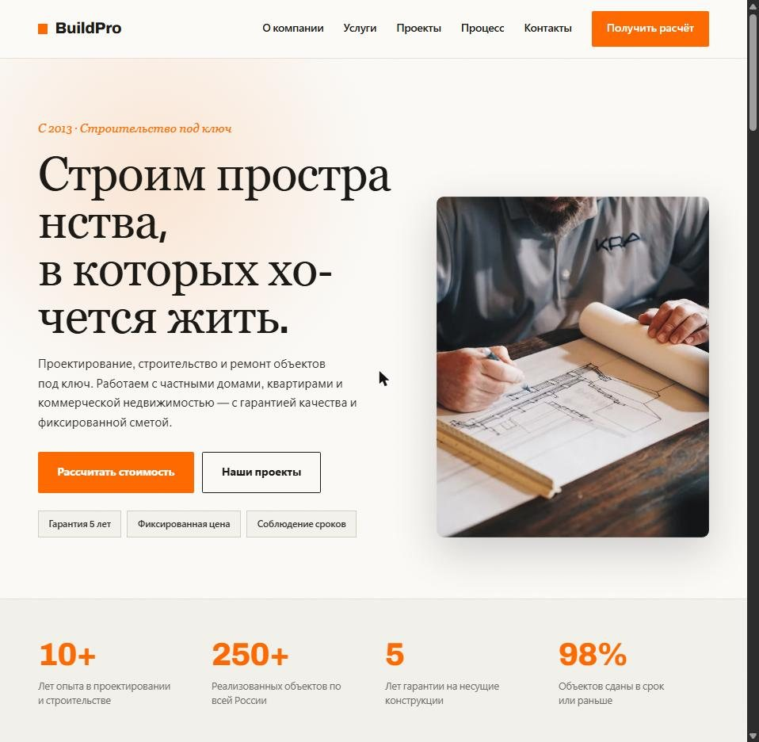
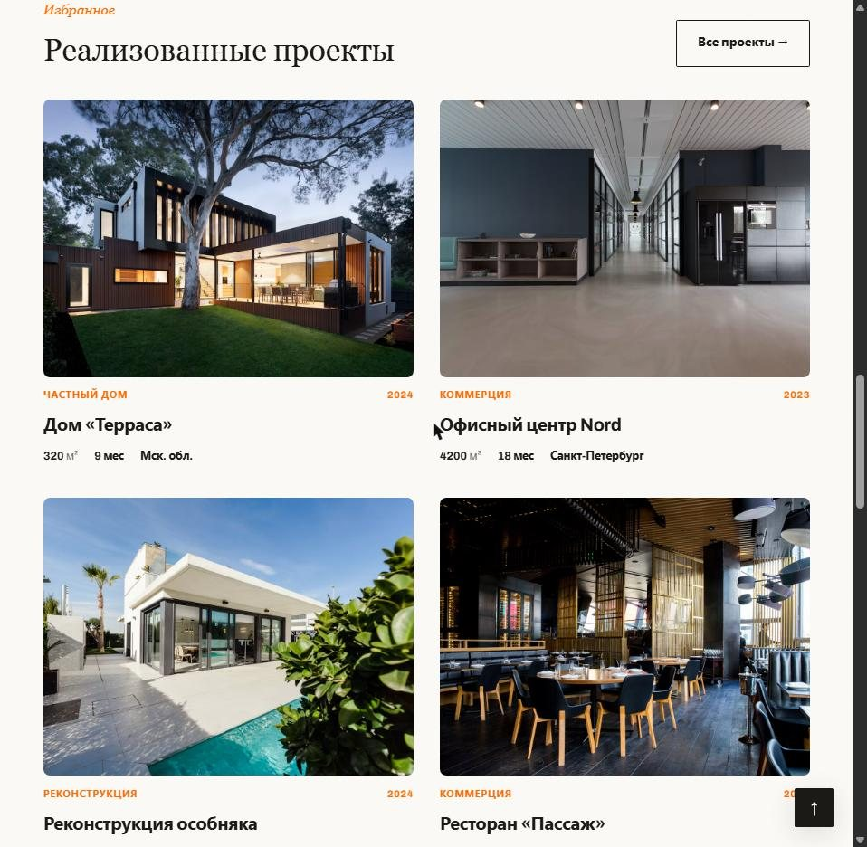

<div align="center">

# 🏗 BuildPro — сайт строительной компании

**Корпоративный многостраничный сайт компании, которая строит дома и коммерческие объекты под ключ.**
Сделан по техническому заданию: услуги, этапы работы, портфолио объектов, отзывы и форма расчёта стоимости.

[](https://fegke12.github.io/landing-construction/)
[](https://fegke12.github.io/landing-construction/projects.html)


<br>



</div>

---

## Задача

По ТЗ сайт должен вызывать доверие у человека, который выбирает подрядчика на дорогую стройку, и вести его по пути **Главная → Услуги → Проекты → Заявка**. Исходное задание лежит в `uploads/`.

## Что сделано

- **Главная:** первый экран с предложением и двумя действиями, блок цифр (опыт, объекты, гарантия, сроки).
- **Услуги полного цикла** — шесть направлений от проектирования до отделки.
- **Шесть этапов работы** — от заявки до сдачи объекта, с ориентировочными сроками.
- **Реализованные проекты** — карточки с типом объекта, площадью, сроком и городом, плюс отдельная страница `projects.html` с фильтрами по типу объекта.
- **О команде** и **отзывы** в слайдере с автопрокруткой.
- **Форма расчёта стоимости** с типом объекта, площадью и проверкой полей перед отправкой.
- Своя **страница 404**, плавная прокрутка, кнопка «наверх», адаптив под телефоны и планшеты.

## Скриншоты

<table>
  <tr>
    <td width="70%"></td>
    <td align="center"></td>
  </tr>
  <tr>
    <td align="center"><sub>Портфолио объектов</sub></td>
    <td align="center"><sub>Мобильная версия</sub></td>
  </tr>
</table>

## Структура

```
index.html        главная
projects.html     все проекты
404.html          страница «не найдено»
css/style.css     основные стили
css/responsive.css адаптив
js/main.js        меню, слайдер отзывов, фильтры проектов, проверка формы
```

Сборка не нужна — откройте `index.html` в браузере. Хостинг — GitHub Pages.

---

<div align="center"><sub>Сделано <a href="https://github.com/Fegke12">@Fegke12</a> · BuildPro — компания из технического задания</sub></div>
